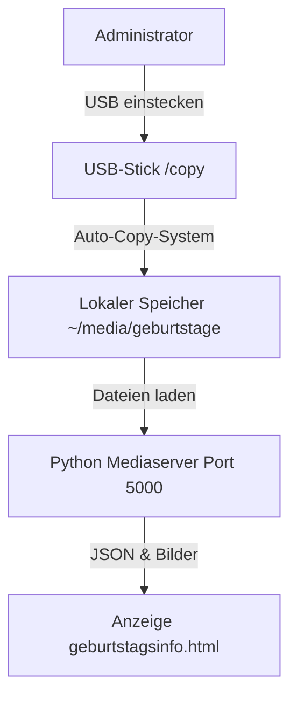

# 🎂 Infodisplay Geburtstagsinfo

Eine vollständige Digital-Signage-Lösung zur Anzeige der Geburtstage der aktuellen Woche. Entwickelt für **Pisignage** auf dem Raspberry Pi, aber auch für andere webbasierte Kiosksysteme geeignet.

## 🏗 Systemarchitektur

Das Projekt besteht aus drei Hauptkomponenten, die zusammenarbeiten:

1.  **Frontend (HTML/JS)**: Die visuelle Ebene, die im Pisignage-Player/Browser läuft.
2.  **Lokaler Mediaserver**: Ein Python-Backend (Flask), das die Excel-Datei und Bilder lokal bereitstellt (um Browser-Sicherheitsbeschränkungen zu umgehen und den Sicherheitsstandards der BV für Sensible Informationen zu entsprechen).
3.  **Content-Management (USB)**: Ein automatisierter Hintergrunddienst, um Inhalte per USB-Stick ohne Netzwerkzugang zu aktualisieren (um den Sicherheitsstandards der BV für Sensible Informationen zu entsprechen).



---

## 📂 Projektstruktur

```text
.
├── geburtstagsinfo.html       # 🚀 PRODUKTION: Hauptanzeigedatei
├── geburtstagsinfo_log.html   # 🔧 DEBUG: Wie oben, aber mit On-Screen-Logging
├── geburtstage/                # Beispiel-Datenstruktur
│   ├── geburtstage.xlsx        # Die Geburtstagsdatenbank (nicht online)
│   └── placeholder.jpg         # Standardbild
├── Installation Files/         # Installationsskripte für Raspberry Pi
│   ├── install_mediaserver.sh  # Installiert den lokalen Flask-Server
│   ├── install_usb_copy.sh     # Installiert den USB-Autokopierer
│   └── (readmes...)
└── _old/                       # Alte Dateien (Referenz)
```

---

## 🖥️ 1. Frontend (Anzeige)

### `geburtstagsinfo.html`
Diese Datei wird auf Pisignage hochgeladen oder im Kiosk-Browser geöffnet.

*   **Abhängigkeiten**: Nutzt `SheetJS` (über CDN), um Excel-Dateien direkt im Browser zu parsen. *Hinweis: Internetzugang erforderlich, um die Bibliothek zu laden.*
*   **Logik**:
    1.  Holt `geburtstage.xlsx` von `http://localhost:5000/files`.
    2.  Berechnet die aktuelle Woche (Montag bis Sonntag).
    3.  Filtert Einträge basierend auf der **Einwilligungsspalte** (siehe unten).
    4.  Zeigt Karten für alle Geburtstage im Zeitraum an.
*   **Visuals**:
    *   **Geburtstag heute**: Wird mit "Schimmer"-Animation und Vergrösserung hervorgehoben.
    *   **Responsiv**: Horizontal scrollender Slider.

### `geburtstagsinfo_log.html`
Diese Version verwenden, falls der Bildschirm leer bleibt oder Daten nicht geladen werden. Es wird eine Konsole eingeblendet, die Netzwerkfehler anzeigt (z.B. wenn der Mediaserver nicht läuft).

### Geschäftslogik & Datenschutz (Einwilligung)
Das System respektiert eine bestimmte Spalte in der Excel-Datei für Datenschutz (von Mitarbeitenden gewählt).

| Symbol | Bedeutung | Anzeigeverhalten |
| :--- | :--- | :--- |
| 🟢 | **Volle Einwilligung** | Zeigt Name, Datum und **Benutzerfoto** (falls vorhanden). |
| 🟡 | **Teilweise Einwilligung** | Zeigt Name und Datum, aber immer das **Standardbild** (versteckt echtes Foto). |
| 🔴 | **Keine Einwilligung** | **Ignoriert** den Eintrag komplett. Die Person wird nicht angezeigt. |

---

## ⚙️ 2. Backend (Mediaserver)

Browser blockieren das Lesen lokaler Dateien (`/home/pi/...`) aus Sicherheitsgründen. Um die Excel-Datei und Profilfotos dynamisch zu lesen, wird ein kleiner lokaler Webserver verwendet.

*   **Skript**: `Installation Files/install_mediaserver.sh`
*   **Technologie**: Python Flask + Waitress + Systemd.
*   **Port**: `5000`
*   **Quellordner**: `~/media/geburtstage` (auf dem Pi).

**Installation:**
```
siehe `Installation Files\readme_mediaserver.md`
```

---

## 🔄 3. Inhaltsaktualisierung (USB Copy)

Um die Liste ohne SSH oder FTP zu aktualisieren, einfach einen USB-Stick verwenden.

*   **Skript**: `Installation Files/install_usb_copy.sh`
*   **Trigger**: Erkennt USB-Einstecken via `udev`.

**So geht's:**
1.  Einen Ordner namens **`copy`** auf dem USB-Stick erstellen.
2.  Die `geburtstage.xlsx` und Fotos (z.B. `user1.jpg`, `user2.jpg`) hineinlegen.
3.  USB-Stick in den laufenden Raspberry Pi einstecken.
4.  10 Sekunden warten. Die Dateien werden nach `~/media/geburtstage` kopiert.

**Installation:**
```
siehe `Installation Files\readme_usb_copy.md`
```

---

## 📝 Datenanforderungen (`geburtstage.xlsx`)

Die Excel-Datei muss eine bestimmte Struktur haben (Kopfzeile in der ersten Zeile).

| Spaltenname (exakt) | Beschreibung |
| :--- | :--- |
| **Name** | Der angezeigte Name auf der Karte. |
| **Geburtsdatum** | Geburtsdatum (Format: `TT.MM.JJJJ`). |
| **Dateiname Foto** | Dateiname des Bildes (z.B. `max_mustermann.jpg`). Muss im gleichen Ordner liegen. |
| **Welche Informationen dürfen wir für die Anzeige verwenden?** | Die Einwilligungsspalte. Muss mit 🟢, 🟡 oder 🔴 beginnen. |

**Beispielzeile:**
| Name | Geburtsdatum | Dateiname Foto | Welche Informationen dürfen wir für die Anzeige verwenden? |
| :--- | :--- | :--- | :--- |
| Max Mustermann | 14.05.1985 | max_mustermann.jpg | 🟢 Geburtstag + Foto: Ich bin damit einverstanden, dass mein Geburtsdatum, mit Foto von mir verwendet wird. |
| Erika Musterfrau | 15.05.1990 | erika_musterfrau.jpg | 🟡 Geburtsdatum ohne Foto: Ich bin einverstanden, dass mein Geburtsdatum ohne Foto angezeigt wird. |
| Peter Spielverderber | 19.12.1950 | peter_spielverderber.jpg | 🔴 Keine Anzeige: Ich möchte nicht, dass diese Information veröffentlicht wird. |
